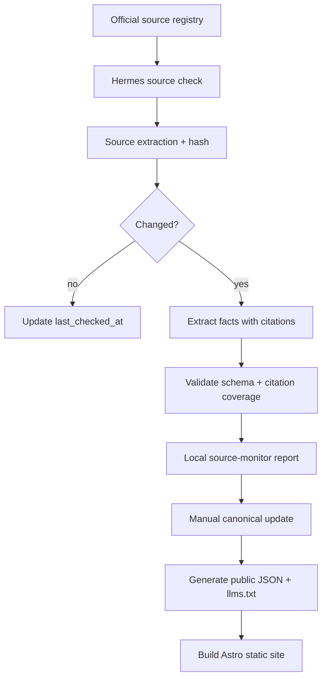

# World Immigrant — Technical Approach Deep Dive

## 1. Technical thesis

World Immigrant should be a **static-first, data-first public knowledge system**.

The product should feel like a modern app, but the architecture should behave like durable public infrastructure:

- every page has crawlable HTML;
- every important fact exists in structured JSON/YAML;
- every material field has citations;
- every generated artifact can be rebuilt from source data;
- no runtime backend is required for the public site;
- user profile filtering runs locally in the browser;
- Hermes performs source monitoring and opens PRs.

## 2. Recommended stack

| Layer | Recommendation | Why |
| --- | --- | --- |
| Package manager | pnpm | User/project convention; efficient installs. |
| Site framework | Astro static output | Content-heavy, SEO/AEO/GEO-friendly, low JS, content collections/data collections. |
| Interactive UI | Frameworkless Astro/TypeScript islands for the site | Keeps JS and dependency footprint smallest; React/Preact can be reconsidered if supply-chain checks pass. |
| Types | TypeScript strict | Prevent data/UI drift. |
| Schema | Zod + generated JSON Schema | Validate source data and power editor hints. |
| Search | Pagefind | Static full-text search; no backend infra; suitable for large static sites. |
| Filter engine | Custom TypeScript predicates | Eligibility logic is domain-specific and must produce cited reasons. |
| Routing/state | Astro pages + URLSearchParams; optionally TanStack Router inside a heavy island if needed | Avoid SPA complexity; keep compare/filter URLs shareable. |
| Markdown | Astro/content pipeline for server/build rendering; lightweight renderer only if dynamic snippets need Markdown client-side | Avoid shipping too much JS. |
| Automation | Hermes cron + scripts + PRs | Fits source monitoring and human review model. |
| Hosting | Cloudflare Workers | Static, cheap/free, public-good friendly. |

## 3. Why Astro over pure Vite SPA

A pure Vite SPA is tempting because it is lightweight and app-like. But this product is not just an app; it is a public knowledge base.

Astro is better because:

- each country/program/category page becomes real HTML;
- search engines and AI crawlers can read content without running app state;
- data can still power TypeScript islands for compare/filter;
- content collections/data collections give schema-validated content organization;
- default JS is minimal;
- static deployment is straightforward.

Use framework code only where interactivity truly needs it. The site starts with Astro components and small vanilla TypeScript scripts; add React/Preact if complexity justifies it.

## 4. Content/data architecture

### 4.1 Canonical data lives in repo

Suggested source layout:

```text
src/data/
├── countries/
│  ├── canada.json
│  └── portugal.json
├── programs/
│  ├── canada-express-entry-fsw.json
│  └── portugal-d8-digital-nomad.json
├── categories.json
├── sources/
│  ├── canada-ircc-fsw.json
│  └── canada-ircc-proof-of-funds.json
├── taxonomies/
│  ├── countries.json
│  ├── occupations.json
│  └── currencies.json
└── schemas/
  ├── country.schema.json
  ├── program.schema.json
  └── source.schema.json
```

### 4.2 Generated public artifacts

```text
public/
├── data/
│  ├── index.json
│  ├── countries/{country}.json
│  ├── programs/{program}.json
│  ├── indexes/filter-index.json
│  ├── indexes/compare-index.json
│  └── sources.json
├── schema/
│  ├── country.schema.json
│  ├── program.schema.json
│  └── source.schema.json
├── llms.txt
├── llms-full.txt
└── skills/use-world-immigrant/SKILL.md
```

The source data can contain internal validation details; public data should be generated and normalized for consumers.

### 4.3 Canonical loader

A shared TypeScript loader reads one-file-per-entity directories, validates each entry with Zod, sorts by stable ID, and feeds the validator, generators, and Astro routes. Keeping this logic outside Astro prevents build tools from interpreting the same dataset differently.

## 5. Static search vs structured filtering

Search and filtering are different systems.

### 5.1 Pagefind for full-text search

Use Pagefind for:

- program names;
- country pages;
- explainer text;
- source pages;
- multilingual search.

Do not rely on Pagefind for eligibility logic.

### 5.2 Custom filter engine for eligibility

Use `filterEngine.ts` for:

- hard blockers;
- soft warnings;
- unknown fields;
- result scoring;
- cited reasons;
- follow-up questions.

The engine should load `filter-index.json`, not the full content database.

```text
Full data → build-time normalization → compact filter index → browser filter engine
```

## 6. Data pipeline



## 7. Validation layers

### 7.1 Schema validation

Fail if:

- required fields are missing;
- enum values are invalid;
- money/currency shapes are invalid;
- unknown values are omitted instead of explicit;
- citations use missing source IDs.

### 7.2 Citation coverage

Fail if an active program lacks citations for:

- money thresholds;
- age thresholds;
- income thresholds;
- job offer requirement;
- degree/language requirement;
- family inclusion;
- work rights;
- PR/citizenship pathway;
- processing time;
- status active/paused/closed.

### 7.3 Freshness validation

The normal build warns; the explicit strict freshness audit fails. Both report:

- Tier 1 source overdue > 3 days;
- Tier 2 overdue > 7 days;
- Tier 3 overdue > 30 days;
- official URL returns error;
- extracted text hash changed but data not updated.

### 7.4 Generated artifact validation

Check:

- `public/data/index.json` references existing public program files;
- `llms.txt` links resolve;
- each public JSON file matches schema;
- no private fields or tokens leak;
- source URLs are valid HTTP(S).

## 8. Source registry design

```ts
type SourceRegistryEntry = {
 id: string;
 country_id: string;
 program_ids: string[];
 url: string;
 title: string;
 publisher: string;
 source_type:
  | "official"
  | "law"
  | "government_pdf"
  | "embassy"
  | "official_calculator"
  | "reputable_secondary";
 language: string;
 priority: 1 | 2 | 3;
 update_frequency_days: number;
 extraction_method: "web_extract" | "browser" | "pdf" | "manual";
 expected_content_hints?: string[];
 last_checked_at?: string;
 last_success_at?: string;
 last_hash?: string;
 status: "active" | "broken" | "needs_attention" | "deprecated";
};
```

## 9. Policy data confidence

Use separate confidence concepts:

1. **Source confidence**: how authoritative the source is.
2. **Extraction confidence**: how clearly the field was extracted.
3. **Policy stability**: how likely the program/rule is to change.
4. **Recommendation confidence**: how confident the filter engine is for a user profile.

Example:

```ts
type Confidence = {
 source_confidence: 1 | 2 | 3 | 4 | 5;
 extraction_confidence: 1 | 2 | 3 | 4 | 5;
 policy_stability: 1 | 2 | 3 | 4 | 5;
 needs_human_review: boolean;
 rationale_md?: LocalizedMarkdown;
};
```

## 10. Compare/filter performance

Data size should be small enough for simple browser JSON. Still design for scale:

- Generate compact indexes instead of loading all Markdown.
- Split by category or country if needed.
- Use lazy loading or small inline module scripts for compare/filter islands.
- Keep Pagefind index separate.
- Prefer numeric normalized USD fields for filtering; preserve original currency alongside.

Suggested generated indexes:

```text
public/data/indexes/filter-index.v1.json
public/data/indexes/compare-index.v1.json
public/data/indexes/source-freshness.v1.json
public/data/indexes/category-digital-nomad.v1.json
```

## 11. URL and state architecture

For simple filter state, use query params:

```text
/filter?category=skilled_worker&citizenship=CN&age=29&degree=master&goal=pr
```

For larger local profile:

```ts
type LocalProfileEnvelope = {
 schema_version: 1;
 created_at: string;
 updated_at: string;
 profile: UserProfile;
};
```

Storage rules:

- No server storage.
- No analytics payload containing full profile by default.
- Allow “Export profile JSON” and “Import profile JSON”.
- Warn users before they share profile URLs if sensitive fields are encoded.

## 12. AI-native public outputs

### 12.1 `llms.txt`

`llms.txt` should include:

- mission and disclaimer;
- data endpoints;
- schema endpoints;
- citation policy;
- instructions for interpreting unknown/stale data;
- links to major category/country indexes.

### 12.2 `llms-full.txt` or chunks

Generated from structured data and key pages. If too large:

```text
/llms-full/index.txt
/llms-full/countries/canada.txt
/llms-full/categories/digital-nomad.txt
```

### 12.3 Public skill

`public/skills/use-world-immigrant/SKILL.md` should tell agents:

1. Load `/data/index.json`.
2. Filter by category/country.
3. Fetch program JSON.
4. Quote citations.
5. Never present eligibility as legal advice.
6. Show freshness and uncertainty.

### 12.4 Optional MCP

MCP should not be runtime because the site is static. Additionally, publish a local MCP server package that reads the static JSON:

```bash
npx world-immigrant-mcp --data-url https://world-immigrant.com/data/index.json
```

Tools could include:

- `search_programs`;
- `compare_programs`;
- `check_profile_against_programs`;
- `get_sources`;
- `get_recent_changes`.

## 13. Internationalization

Separate:

- canonical facts;
- localized labels;
- localized Markdown explanations;
- official source language;
- translated source summaries.

Rules:

- Do not translate official program names unless official localized names exist.
- Preserve original legal terms with parenthetical explanations.
- Localized text inherits citations from canonical fields.
- Filter logic never depends on localized prose.

Initial locales:

- `en`
- `zh-Hans`

Later:

- `es`, `fr`, `de`, `pt`, `ja`, `ko`, `ar`, etc.

## 14. Security and privacy

### 14.1 Secrets

No secrets needed for public frontend. Automation secrets stay outside repo in Hermes environment.

### 14.2 User profile privacy

- Local-only by default.
- No account.
- No server-side eligibility processing.
- If analytics is added, never send raw profile fields without explicit consent.

### 14.3 Legal risk

- Clear informational disclaimer.
- Avoid “guaranteed eligibility” language.
- Show citations and unknowns.
- Use “preliminary match” wording.

## 15. Build strategy for 

Workflows should be tiered:

Fast checks during iteration:

```bash
pnpm data:validate
pnpm check
```

Full release checks:

```bash
pnpm data:validate
pnpm llms:generate
pnpm build
pnpm pagefind --site dist
```

Avoid Next.js/Turbopack and memory-heavy workflows.

## 16. Implementation sequence

1. Define schemas and validators before UI.
2. Add one real country/program fixture with official citations.
3. Generate public JSON and `llms.txt`.
4. Render static country/program pages.
5. Add compare page using `compare-index`.
6. Add filter page using `filter-index` and reason engine.
7. Add Pagefind search after pages exist.
8. Add Hermes update workflow.
9. Expand data coverage.
10. Add optional MCP/skill after static JSON stabilizes.

## 17. Architecture decisions to carry forward

| ID | Decision | Rationale |
| --- | --- | --- |
| ARCH-014 | Use compact generated indexes for compare/filter instead of loading all source data | Keeps browser fast and separates canonical data from UX data |
| ARCH-015 | Treat user profile filtering as local-only | Privacy and public-good trust |
| ARCH-016 | Separate factual fields from interpretive scores | Avoid mixing official facts with product opinions |
| ARCH-017 | Generate AI-readable outputs | AI agents/search are first-class users |
| ARCH-018 | Keep MCP optional and external to static site runtime | Static hosting cannot serve MCP directly |
