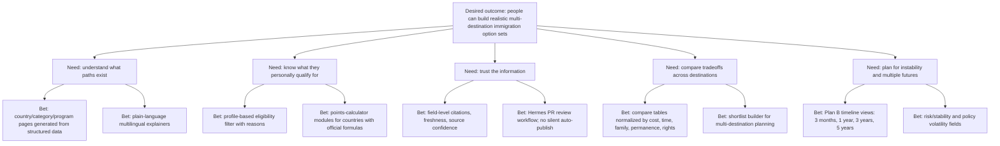

# World Immigrant — Public Good Product Strategy

## 1. Mission

**World Immigrant exists to help people preserve and expand their freedom of movement.**

In a world that is becoming more unstable, unequal, and conflict-prone, having more than one possible destination is not a luxury. For many people it is a form of resilience: a way to protect family, work, safety, education, health, and long-term dignity.

The product goal is not to sell migration dreams. The goal is to make the “world immigrant dream” more achievable by giving everyone clearer access to the rules, paths, tradeoffs, and official sources behind global mobility options.

## 2. Public-good thesis

Most immigration information on the web is either:

- government-authored but fragmented by country and difficult to compare;
- consultant-authored and optimized for leads;
- SEO-authored and hard to verify;
- investor-focused and irrelevant to ordinary people;
- or community/lifestyle-focused without rigorous legal pathway modeling.

World Immigrant should become the public layer between official sources and human decisions:

```text
Official sources → structured facts → cited explanations → filters/comparisons → user agency
```

## 3. Desired outcome

Help users identify a realistic shortlist of countries and immigration pathways they can explore further, with clear reasons and citations.

A practical north-star metric:

> Number of users who can produce a cited, multi-destination immigration options shortlist without submitting personal data to a lead-generation funnel.

Supporting metrics:

- % of active visa programs with official-source citations.
- % of material fields with field-level citations.
- Median source freshness by priority tier.
- Number of countries/categories covered with validated schema.
- Number of generated compare pages indexed by search engines/LLMs.
- Number of external agents/tools using the static JSON or `llms.txt`.

## 4. Opportunity tree



## 5. Target user needs

These are assumptions initially and should be validated with user interviews / usage analytics.

| Priority | User need / job story | Type | Confidence |
| --- | --- | --- | --- |
| 1 | When I feel my current country or life plan is uncertain, I want to know which countries are realistic alternatives, so I can create optionality before crisis. | Functional + emotional | Inferred |
| 2 | When I compare visa paths, I want to know whether a route is temporary or can lead to PR/citizenship, so I do not waste years on a dead end. | Functional | Inferred |
| 3 | When I see immigration claims online, I want citations to official sources, so I can trust and verify the facts myself. | Functional + emotional | Inferred |
| 4 | When I have family constraints, I want to filter by spouse/children rules and extra funds, so the result reflects my actual life. | Functional | Assumed |
| 5 | When I lack high assets, I want non-investment paths to be visible, so I do not assume immigration is only for wealthy people. | Functional + emotional | Inferred |
| 6 | When I am choosing between countries, I want to compare cost, timeline, rights, stability, and obligations in one table, so I can reason clearly. | Functional | Inferred |
| 7 | When information changes, I want to see what changed and when it was checked, so I can avoid stale decisions. | Functional | Inferred |
| 8 | When English/legal language is hard, I want multilingual plain language without losing official names/citations, so I can understand safely. | Functional + emotional | Assumed |

## 6. Product principles

### 6.1 Truth over conversion

No fake scarcity. No “book a call” dark pattern as the primary path. If a referral/service layer exists, it must be clearly separated from public information.

### 6.2 Options over recommendations

The product should avoid pretending to know the single “best country.” Instead it should surface options, tradeoffs, and uncertainty.

### 6.3 Official sources first

Use official government sources wherever possible. Secondary sources can help discover programs or fill context, but must be labeled.

### 6.4 Explicit uncertainty

Unknown is a valid value. “Needs professional review” is better than confident hallucination.

### 6.5 Privacy by default

The site requires no account. Profile filters can run locally in the browser. If profile saving is added, make local-first export/import the default before cloud accounts.

### 6.6 Accessibility and multilingualism

The product should support people outside elite English-speaking circles. Use simple language, translations, and stable data exports.

### 6.7 Public data and AI readability

Static JSON, schemas, `llms.txt`, and optional MCP/skill are not extras. They are how the public-good mission scales through search engines, AI agents, researchers, and civic tools.

## 7. Solution design

### Bet A — Cited visa program pages

Create static pages for a small set of high-demand countries and categories. Each page shows:

- official name;
- short explanation;
- eligibility;
- funds/income;
- rights;
- family rules;
- PR/citizenship pathway;
- source citations;
- freshness.

Why first: without trustworthy atomic pages, compare/filter cannot be trusted.

### Bet B — Compare by category

For each category, let users compare programs side-by-side.

Categories:

1. Digital nomad / remote work.
2. Skilled worker / points-based.
3. Study → work → PR.
4. Startup / entrepreneur.
5. Investor / golden visa-like.

Why second: competitors prove comparison is valuable, but mostly in narrow verticals.

### Bet C — Profile filter with reasons

Ask for minimal profile inputs and classify results. The site does not claim “you qualify.” It should say:

- likely matches;
- possible matches;
- blocked matches;
- unknown/needs review.

Every result should include reasons and citations.

### Bet D — Source freshness and change log

Surface the trust system visually:

- `last_checked_at`;
- `last_changed_at`;
- official source badge;
- source confidence;
- policy status: active / paused / closed / unknown;
- recent change summary.

Why: this is a unique differentiator and essential for high-stakes information.

## 8. Governance model

### Governance

- GitHub repository is source of truth.
- Human-reviewed PRs for data updates.
- Validation scripts enforce citation coverage.
- Changes include source list and freshness.

### Public contributions

Accept contributions for:

- official source URLs;
- data corrections with citations;
- translations;
- country/category expansions;
- UX/data model improvements.

Contribution rules:

- No uncited legal claims.
- No affiliate links in source data.
- No legal advice language.
- Official sources preferred.
- Secondary sources must be labeled.

### Licensing recommendation

Needs final legal review, but initial direction:

- Code: permissive open-source license such as MIT or Apache-2.0.
- Original docs/prose: CC BY 4.0, unless legal concerns suggest otherwise.
- Structured database: consider ODbL or CC BY 4.0 depending on desired reuse obligations.

Important: official government source text may have its own copyright/reuse rules. Store facts, citations, and short quotes; avoid copying large chunks blindly.

## 9. Ethical boundaries

World Immigrant should clearly state:

- It is informational, not legal advice.
- Immigration decisions are high-stakes and may require licensed professionals.
- Eligibility filters are preliminary, not guarantees.
- Policy can change quickly.
- Humanitarian/asylum content requires extra care and should avoid dangerous oversimplification.
- The site should not encourage illegal work/stay or visa misuse.

## 10. Product tone

Tone should be:

- direct;
- calm;
- practical;
- hopeful without hype;
- honest about uncertainty;
- global, not country-supremacist;
- public-service oriented.

Example copy:

> Build your Plan A, Plan B, and Plan C. Compare lawful immigration paths across countries using source-cited data. No account required. No hidden lead funnel. Verify every claim.

## 11. Immediate roadmap implications

1. Add `docs/research/competitor-analysis.md` as a living competitor map.
2. Expand `docs/architecture/data-model.md` with public-good UX fields: permanence, family, risk, freshness, affordability, accessibility.
3. Build first fixture from official sources before scaling.
4. Design filter UX around a local-only profile object.
5. Generate `public/data/` and `llms.txt` early, not as an afterthought.
6. Create contribution guidelines before accepting external data.
